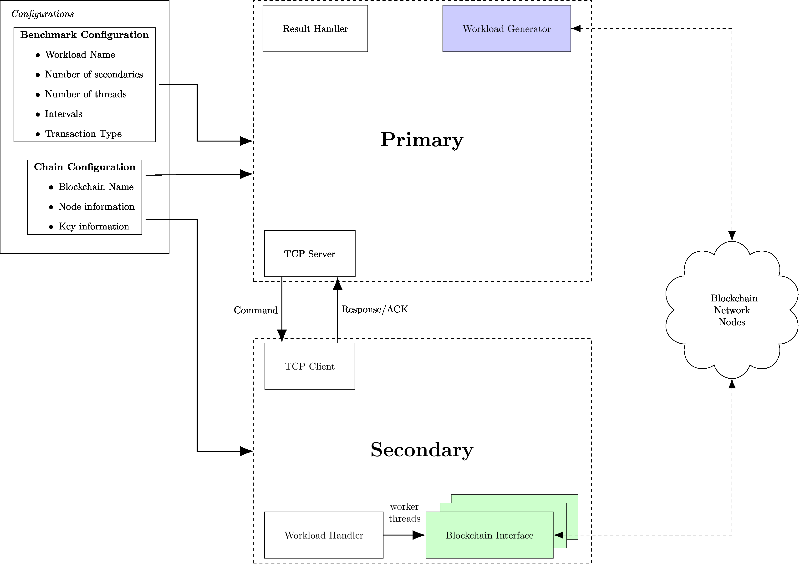

# Diablo: Distributed Analytical BLOckchain Benchmark Framework

Diablo, an analytical blockchain benchmark framework focusing on distributed clients performing real-world workloads. The focus of this benchmark is to provide a benchmark framework with a focus on truly distributed clients performing realistic workloads to evaluate and analyse different blockchain systems.

## Other Sections

* [New Chains](docs/new-chains.md)
* [Running the example](docs/sample-example.md)

## Workloads

* ICO
* Auction
* Gameplay
* Gambling
* Wiki/Website Access
* Shipping Containers
* Exchange

## Architecture

Since the benchmark is developed with distributed clients, the architecture can become quite complex. The main goal is to limit the required implementation details to allow for easy adoption of new chains. We also focus on providing ease of workload definition, which can help provide a pathway for new workloads to be designed in future.



### Configurations

#### Benchmark

The benchmark configuration defines the workload, the number of client machines and the number of worker threads running on the client. This is where the main aspect of the benchmark is defined.

#### Chain

The chain configuration defines the information about the blockchain network. It provides the list of blockchain node addresses and provides information about keys and accounts. The keys are optional, but required if a genesis already exists, or, the blockchain is currently already running.

### Primary

This is the main Diablo node, it orchestrates the benchmark to be run. It generates and distributes the workload to the secondaries, and sends commands to run and retrieve results from the benchmark.

### Secondary

The secondary clients are acting as clients interacting with the blockchain. Each secondary communicates with the primary to recieve commands and run the related work. It may control a group of worker threads, or just run one thread. It connects with the blockchain node and executes the transactions to the connected node.

## Getting Started

### Requirements

* Go `go version 1.14` or greater.


### Installation

1. Clone this repository
2. Run `go mod download` in this repository to install dependencies.
3. Build the benchmark using the `Makefile` or directly calling ``go build main/diablo.go``

### Running the Benchmark

1. Start the primary benchmark node:
```sh
./diablo primary -bc /path/to/benchmark/config -cc /path/to/chain/config -a "<listen_address>:<port>"
```
for example:
```sh
./diablo primary -bc  configurations/workloads/sample/sample_simple.yaml -cc configurations/blockchain-configs/ethereum/ethereum-basic.yaml -a "0.0.0.0:8323"
```

2. Once you see the "ready to connect", start the secondaries on their respective machines:
```sh
./diablo secondary -m "<Primary IP>:<port>" -cc /path/to/chain/config
```
for example:
```sh
./diablo secondary -m "127.0.0.1:8323" --chain-config configurations/blockchain-configs/ethereum/ethereum-basic.yaml
```

If you would like to run the sample benchmark for seeing how diablo operates, please see [Sample Example](docs/sample-example.md).

It will then run through the benchmark and perform the relevant analysis.

## Reading Material (for development)

* Golang Ethereum Developer Book: https://github.com/miguelmota/ethereum-development-with-go-book
* Interacting with contracts via raw transaction creation: https://ethereum.stackexchange.com/questions/10486/raw-transaction-data-in-go
